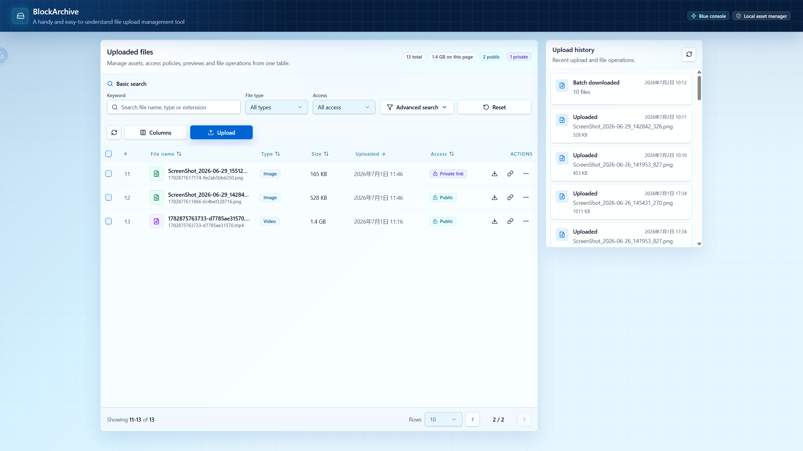
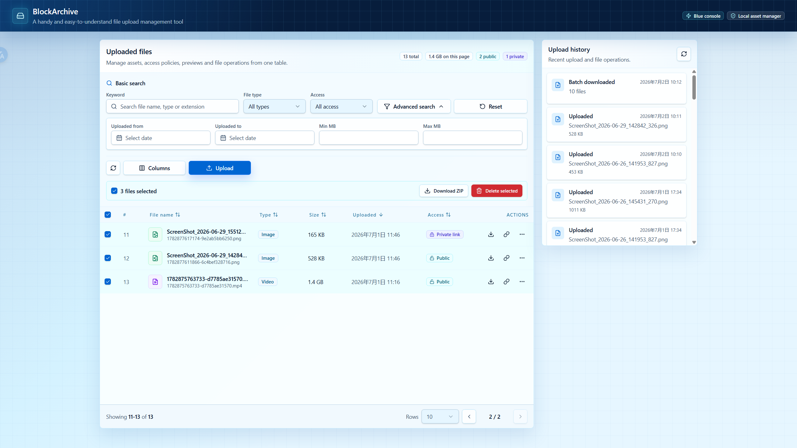
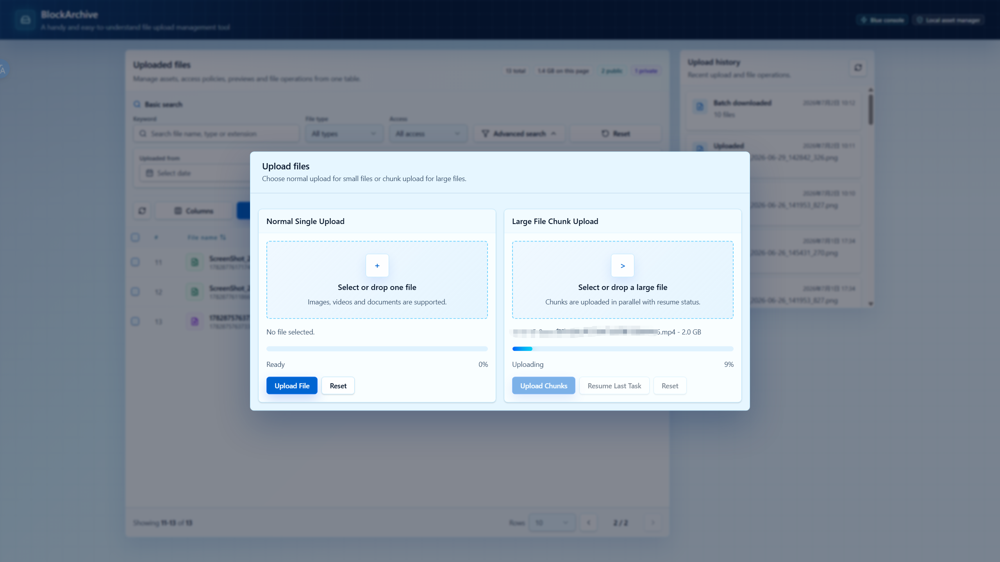
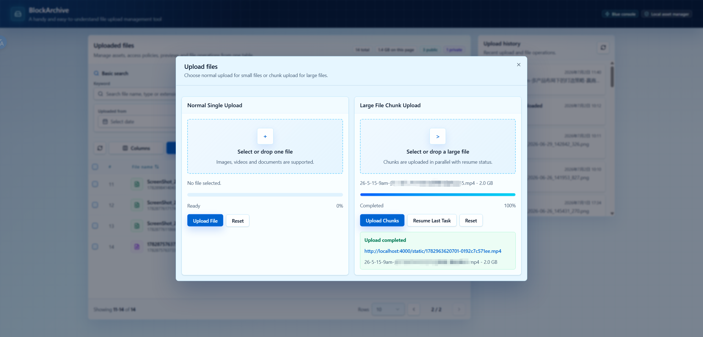
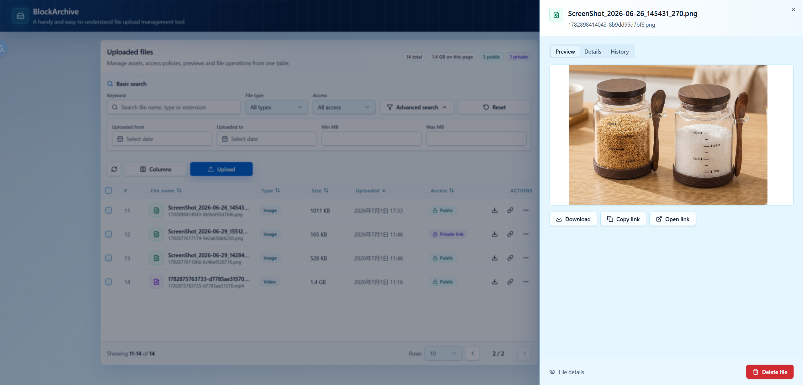

# file-upload-api-demo

这是一个基于 Node.js、Express 和 Vite React 的独立文件上传服务演示项目。它可以作为现有 Web 应用的可复用上传模块：后端可以独立部署为文件资源服务，前端演示页面则覆盖上传、文件管理、预览、分享和批量操作等常见工作流。

## 项目能力

- 通过简单的 `multipart/form-data` 接口上传普通文件。
- 支持大文件分片上传，包括初始化、状态查询、并行上传分片、断点续传和合并。
- 结合服务端分片元数据和浏览器 `localStorage` 恢复中断的分片上传任务。
- 校验文件后缀、MIME 类型、文件大小、分片大小和分片索引。
- 使用唯一文件名将已完成文件保存到本地磁盘，避免覆盖。
- 通过 `/static/:storedFileName` 托管公开文件，并设置缓存和跨域资源响应头。
- 支持将文件设置为 `public` 或 `private`；私有文件通过带 token 的分享链接访问。
- 支持文件列表、关键词搜索、筛选、分页、排序和元数据查看。
- 支持预览、下载、删除、批量删除、批量 ZIP 下载。
- 使用本地历史文件记录上传和文件操作行为。
- 定时清理过期且未合并的临时分片目录。
- 内置 React 文件管理界面，方便快速演示和验收。

项目不依赖数据库。运行时元数据以 JSON 文件形式保存在上传目录中。

## 技术栈

- 后端：Node.js、Express、Multer、Helmet、CORS、Morgan、Archiver
- 前端：React、Vite、Radix UI primitives、Lucide icons、Tailwind CSS
- 存储：默认使用本地文件系统

## 项目结构

```text
src/
  app.js                       Express 应用、全局中间件、静态托管和启动逻辑
  config/index.js              运行配置和环境变量默认值
  controllers/uploadController.js
  routes/uploadRoutes.js       上传与文件管理 API 路由
  services/fileService.js      文件记录、访问链接、历史记录、下载流
  services/chunkService.js     分片任务元数据、续传、分片保存、合并
  middleware/                  上传解析、响应封装、错误处理
  jobs/cleanupChunks.js        过期分片任务定时清理
client/
  src/                         React 上传和文件管理界面源码
  vite.config.js               将前端构建到 public/
public/                        Express 托管的前端构建产物
storage/
  uploads/                     已完成文件和本地 JSON 索引
  chunks/                      临时分片上传目录
```

## 快速开始

安装依赖：

```bash
npm install
```

启动 Express 服务：

```bash
npm start
```

打开内置演示页面：

```text
http://localhost:4000/index.html
```

页面中的 API Base 默认使用当前浏览器地址源。本地测试时应为：

```text
http://localhost:4000
```

## Docker 部署

项目已包含生产用 `Dockerfile` 和 `docker-compose.yml`。Docker 镜像会构建 React 界面到 `public/`，安装生产依赖，以非 root 用户运行，并把运行时文件保存到 `/app/storage`。

使用 Docker Compose 启动：

```bash
docker compose up -d --build
```

打开演示页面：

```text
http://localhost:4000/index.html
```

检查健康状态：

```bash
curl http://localhost:4000/health
```

查看日志：

```bash
docker compose logs -f file-upload-api
```

停止服务并保留已上传文件：

```bash
docker compose down
```

删除容器和上传数据卷：

```bash
docker compose down -v
```

### Docker 环境变量

`docker-compose.yml` 会从当前 shell 或可选的 `.env` 文件读取这些常用变量：

| 变量 | 默认值 | 说明 |
| --- | --- | --- |
| `APP_PORT` | `4000` | 映射到容器 `4000` 端口的宿主机端口。 |
| `PUBLIC_BASE_URL` | `http://localhost:4000` | 用于生成文件链接的公开基础地址。部署时请设置为真实域名或宿主机端口。 |
| `MAX_SINGLE_FILE_SIZE_BYTES` | `104857600` | 普通上传最大文件大小。 |
| `MAX_CHUNK_UPLOAD_FILE_SIZE_BYTES` | `5368709120` | 分片上传最大文件大小。 |
| `MAX_CHUNK_SIZE_BYTES` | `5242880` | 单个分片最大大小。 |
| `DEFAULT_CHUNK_SIZE_BYTES` | `2097152` | 推荐客户端分片大小。 |
| `ALLOWED_ORIGINS` | `*` | CORS 来源白名单，多个值用英文逗号分隔。 |
| `CHUNK_EXPIRY_MS` | `86400000` | 未完成分片任务过期时间。 |
| `CLEANUP_INTERVAL_MS` | `1800000` | 清理任务执行间隔。 |
| `LOG_FORMAT` | `combined` | Docker 环境使用的 Morgan 请求日志格式。 |

示例 `.env`：

```dotenv
APP_PORT=8080
PUBLIC_BASE_URL=http://localhost:8080
ALLOWED_ORIGINS=http://localhost:8080
```

Compose 会使用命名卷持久化已完成文件和分片任务：

```text
upload_data -> /app/storage/uploads
chunk_data  -> /app/storage/chunks
```

### 不使用 Compose 运行

构建镜像：

```bash
docker build -t file-upload-api-demo:latest .
```

运行容器：

```bash
docker run -d \
  --name file-upload-api-demo \
  -p 4000:4000 \
  -e PUBLIC_BASE_URL=http://localhost:4000 \
  -v file_upload_storage:/app/storage \
  file-upload-api-demo:latest
```

## 开发模式

使用 Node watch 模式启动后端：

```bash
npm run dev
```

在第二个终端启动 React 开发服务器：

```bash
npm run client:dev
```

Vite 开发服务器地址：

```text
http://localhost:5173
```

前端开发时，Vite 会将 `/api` 和 `/static` 代理到 `http://localhost:4000`。

构建 React 应用到 `public/`：

```bash
npm run build
```

## 配置说明

配置集中在 `src/config/index.js`，也可以通过环境变量覆盖。

| 变量 | 默认值 | 说明 |
| --- | --- | --- |
| `PORT` | `4000` | Express 服务端口。 |
| `PUBLIC_BASE_URL` | `http://localhost:4000` | 用于生成公开链接、预览链接、下载链接和分享链接的基础地址。 |
| `UPLOAD_DIR` | `storage/uploads` | 已完成上传文件和文件索引目录。 |
| `CHUNK_DIR` | `storage/chunks` | 临时分片上传任务目录。 |
| `MAX_SINGLE_FILE_SIZE_BYTES` | `104857600` | 普通上传最大文件大小，默认 100 MB。 |
| `MAX_CHUNK_UPLOAD_FILE_SIZE_BYTES` | `5368709120` | 分片上传最大文件大小，默认 5 GB。 |
| `MAX_CHUNK_SIZE_BYTES` | `5242880` | 单个分片最大大小，默认 5 MB。 |
| `DEFAULT_CHUNK_SIZE_BYTES` | `2097152` | 推荐分片大小，默认 2 MB。 |
| `ALLOWED_ORIGINS` | `*` | CORS 来源白名单，多个值用英文逗号分隔。 |
| `CHUNK_EXPIRY_MS` | `86400000` | 未完成分片任务过期时间，默认 24 小时。 |
| `CLEANUP_INTERVAL_MS` | `1800000` | 清理任务执行间隔，默认 30 分钟。 |
| `LOG_FORMAT` | `dev` | Morgan 请求日志格式。 |

允许的文件后缀：

```text
.jpg, .jpeg, .png, .gif, .webp, .mp4, .mov, .pdf, .doc, .docx, .xls, .xlsx, .txt, .csv, .zip
```

允许的 MIME 类型覆盖常见图片、视频、PDF、Word、Excel、文本、CSV 和 ZIP 格式。

## 前端演示功能

内置 React 界面提供：

- 普通上传和大文件分片上传两个入口。
- 拖拽选择文件。
- 上传进度和状态提示。
- 基于浏览器本地任务元数据的分片续传。
- 支持选择行、自定义列、分页和排序的文件表格。
- 关键词搜索，以及文件类型、访问权限、上传日期、文件大小范围筛选。
- 公开/私有访问权限切换。
- 私有分享链接 token 轮换。
- 预览、复制链接、下载、删除、批量删除和批量 ZIP 下载。
- 上传历史侧栏。

## 项目截图

`screenshot/` 目录包含当前项目内置 `BlockArchive` 演示界面的截图。

### 文件管理主界面



主界面展示已上传文件、统计标签、关键词搜索、文件类型和访问权限筛选、可排序列、单文件操作、分页，以及右侧上传历史面板。

### 高级搜索和批量操作



展开高级搜索后，可以按上传日期和文件大小范围筛选文件。选中多行后，界面会显示批量 ZIP 下载和批量删除操作。

### 上传弹窗和分片进度



上传弹窗同时提供普通单文件上传和大文件分片上传。分片上传区域会显示上传进度、任务状态，以及恢复上次任务的操作入口。

### 分片上传完成状态



所有分片上传并合并完成后，界面会显示完成状态、生成的静态文件访问地址，以及最终上传文件信息。

### 文件预览抽屉



预览抽屉支持在线查看可预览文件，并可在预览、详情、历史记录之间切换，同时提供下载、复制链接、打开链接和删除文件等操作。

## API 响应格式

成功的 JSON 响应格式：

```json
{
  "success": true,
  "message": "Success message.",
  "data": {},
  "timestamp": "2026-07-01T00:00:00.000Z"
}
```

错误响应格式：

```json
{
  "success": false,
  "message": "This file extension is not allowed.",
  "error": {
    "code": 400,
    "details": {
      "extension": ".exe"
    }
  },
  "timestamp": "2026-07-01T00:00:00.000Z"
}
```

文件流和 ZIP 下载接口返回二进制内容，不使用 JSON 包装。

## REST API

上传 API 基础路径：

```text
/api/uploads
```

### 健康检查

```http
GET /health
```

### 获取上传配置

```http
GET /api/uploads/config
```

返回上传大小限制、允许的文件后缀、允许的 MIME 类型和公开基础地址。

### 上传单个文件

```http
POST /api/uploads/single
Content-Type: multipart/form-data
```

| 字段 | 类型 | 必填 | 说明 |
| --- | --- | --- | --- |
| `file` | File | 是 | 要上传的文件。 |

### 初始化分片上传

```http
POST /api/uploads/chunks/init
Content-Type: application/json
```

```json
{
  "fileName": "product-demo.mp4",
  "mimeType": "video/mp4",
  "fileSize": 73400320,
  "chunkSize": 2097152,
  "totalChunks": 35
}
```

如果服务端找到未过期且参数匹配的未完成上传任务，会返回已有的 `uploadId`、已上传分片索引，并带有 `resumed: true`。

### 查询分片上传状态

```http
GET /api/uploads/chunks/:uploadId/status
```

返回任务状态、已上传分片索引和缺失分片索引。

### 上传单个分片

```http
POST /api/uploads/chunks/:uploadId/part
Content-Type: multipart/form-data
```

| 字段 | 类型 | 必填 | 说明 |
| --- | --- | --- | --- |
| `chunk` | File | 是 | 当前分片二进制内容。 |
| `chunkIndex` | Number | 是 | 从 0 开始的分片索引。 |

后端会检查每个分片大小是否符合预期字节范围，最后一个分片可以小于标准分片大小。

### 合并分片

```http
POST /api/uploads/chunks/:uploadId/merge
```

按数字顺序合并所有分片，校验最终文件大小，保存完整文件记录，并删除临时分片目录。

### 获取上传文件列表

```http
GET /api/uploads/files?page=1&pageSize=20&keyword=demo&sortBy=uploadedAt&sortOrder=desc
```

支持的查询参数：

| 参数 | 说明 |
| --- | --- |
| `page` | 页码，从 `1` 开始。 |
| `pageSize` | 可选值为 `20`、`30`、`50`、`100`。 |
| `keyword` | 搜索原始文件名、存储文件名、文件类型和后缀。 |
| `sortBy` | `fileName`、`fileType`、`uploadedAt`、`size` 或 `visibility`。 |
| `sortOrder` | `asc` 或 `desc`。 |
| `fileType` | `image`、`video`、`pdf`、`document`、`spreadsheet`、`archive`、`text` 或 `all`。 |
| `visibility` | `public`、`private` 或 `all`。 |
| `uploadedFrom` | 上传日期起始筛选，包含当天。 |
| `uploadedTo` | 上传日期结束筛选，包含当天。 |
| `minSize` | 最小文件大小，单位为字节。 |
| `maxSize` | 最大文件大小，单位为字节。 |

### 获取单个文件记录

```http
GET /api/uploads/files/:storedFileName
```

### 预览单个文件

```http
GET /api/uploads/files/:storedFileName/preview
```

以内联方式流式返回文件。

### 下载单个文件

```http
GET /api/uploads/files/:storedFileName/download
```

以附件形式下载文件，并使用原始文件名。

### 更新文件访问权限

```http
PATCH /api/uploads/files/:storedFileName/access
Content-Type: application/json
```

```json
{
  "visibility": "private",
  "rotateShareToken": true
}
```

`visibility` 可以是 `public` 或 `private`。当文件为私有时，`/static/:storedFileName` 会被拒绝访问，客户端应使用带 token 的分享链接。

### 轮换私有分享链接

```http
POST /api/uploads/files/:storedFileName/share
```

生成新的分享 token，并返回更新后的 `shareUrl` 和 `shareDownloadUrl`。

### 通过分享链接预览文件

```http
GET /api/uploads/share/:token
```

### 通过分享链接下载文件

```http
GET /api/uploads/share/:token/download
```

### 删除单个文件

```http
DELETE /api/uploads/files/:storedFileName
```

### 批量删除文件

```http
POST /api/uploads/files/batch-delete
Content-Type: application/json
```

```json
{
  "storedFileNames": ["file-a.pdf", "file-b.png"]
}
```

返回每个文件的删除成功或失败详情。

### 批量下载文件

```http
POST /api/uploads/files/batch-download
Content-Type: application/json
```

```json
{
  "storedFileNames": ["file-a.pdf", "file-b.png"]
}
```

以 ZIP 文件流的形式返回可下载的已选文件。

### 获取上传历史

```http
GET /api/uploads/history?limit=80
```

可选查询参数：

| 参数 | 说明 |
| --- | --- |
| `limit` | 返回记录数，范围为 `1` 到 `200`。 |
| `storedFileName` | 只查看某个存储文件名相关的历史。 |

## 静态文件访问

公开文件可以直接访问：

```http
GET /static/:storedFileName
```

静态文件响应包含浏览器缓存和跨域资源响应头。私有文件在该路由会返回 `403`，必须通过分享链接访问。

## 文件记录结构

上传和文件列表接口会返回类似结构：

```json
{
  "id": "1782450099999-f6e5d4c3b2a1.pdf",
  "originalName": "contract.pdf",
  "storedFileName": "1782450099999-f6e5d4c3b2a1.pdf",
  "mimeType": "application/pdf",
  "fileType": "pdf",
  "extension": ".pdf",
  "size": 245760,
  "uploadedAt": "2026-07-01T00:00:00.000Z",
  "visibility": "public",
  "publicUrl": "http://localhost:4000/static/1782450099999-f6e5d4c3b2a1.pdf",
  "previewUrl": "http://localhost:4000/api/uploads/files/1782450099999-f6e5d4c3b2a1.pdf/preview",
  "downloadUrl": "http://localhost:4000/api/uploads/files/1782450099999-f6e5d4c3b2a1.pdf/download",
  "shareUrl": "http://localhost:4000/api/uploads/share/<token>",
  "shareDownloadUrl": "http://localhost:4000/api/uploads/share/<token>/download"
}
```

## 存储说明

- 已完成文件默认写入 `storage/uploads`。
- 文件记录保存在 `storage/uploads/.file-index.json`。
- 文件操作历史保存在 `storage/uploads/.file-history.json`。
- 临时分片任务保存在 `storage/chunks/:uploadId`。
- 清理任务会根据 `CHUNK_EXPIRY_MS` 删除过期的未完成分片目录。

生产环境可以将本地磁盘写入替换为 AWS S3、Cloudflare R2、Google Cloud Storage 或 Azure Blob Storage 等对象存储。多实例部署时，建议将文件索引和分片任务状态迁移到数据库、Redis 或云厂商 multipart upload 状态中。

## 生产级扩展方向

- 登录认证，以及按用户、租户或工作区隔离文件。
- 上传、列表、预览、下载、分享、删除等操作的权限校验。
- 上传限流和请求配额。
- 病毒扫描和内容安全审核。
- 图片/视频缩略图和媒体元数据提取。
- CDN 集成，加速公开资源访问。
- 后台队列处理转码、压缩和清理任务。
- 数据库级审计历史。

## 作品集简介

这个项目展示了一个完整的独立上传模块：普通上传、大文件分片上传、断点续传、本地静态托管、私有分享链接、文件管理、批量操作、文件校验、清理任务和 React 演示界面。它可以接入现有客户系统，不需要数据库，也不需要重写整套业务应用。
